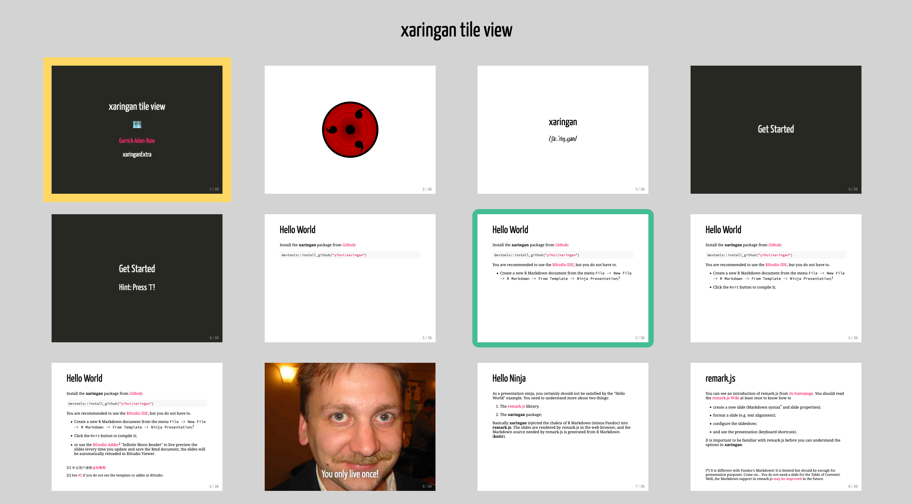

# xaringanExtra

<!-- badges: start -->
<!-- badges: end -->

<!-- Links -->
[xaringan]: https://slides.yihuie.name/xaringan
[remarkjs]: http://remarkjs.com/
[animate.css]: http://daneden.github.io/animate.css

`xaringanExtra` is a playground of enhancements and addins for [xaringan] slides.

## Installation

You can install the current version of xaringanExtra from GitHub.

``` r
# install.packages("devtools")
devtools::install_github("gadenbuie/xaringanExtra")
```

## &#x1F5FA; Tile View

#### &#x1F4FA; [Tile View Demo](https://gadenbuie.github.io/xaringanExtra/tile-view)

Tile view gives you a way to quickly jump between slides.
Just press <kbd>T</kbd> at any point in your slideshow and the tile view appears.
Click on a slide to jump to the slide, or press <kbd>T</kbd> to exit tile view.



To add tile view to your xaringan presentation, 
add the following code chunk to your slides' R Markdown file.

````markdown
```{r xaringan-tile-view, echo=FALSE}
xaringanExtra::use_tile_view()
```
````

Tile view is heavily inspired by
(and is essentially a port to Vanilla JavaScript of)
[a jQuery remarkjs hook](https://github.com/StephenHesperus/remark-hook/)
by the same name by [Stephen Hesperus](https://github.com/StephenHesperus).

## &#x1F50A; Slide Tone

#### &#x1F4FA; [Slide Tone Demo](https://gadenbuie.github.io/xaringanExtra/slide-tone)

Slide tone plays a subtle sound when you change slides.
It was 
[requested by a blind R user](https://github.com/yihui/xaringan/issues/214)
and enables users to hear an auditory signal of their progress through the slides.

The tones increase in pitch for each slide from a low C to a high C note.
The tone pitch stays the same for incremental slides.

Visit the 
[slide tone demo slides](https://gadenbuie.github.io/xaringanExtra/slide-tone)
to experience it yourself.
Or include slide tone in your next xaringan presentation 
by adding the following code chunk to your slides' R Markdown.

````markdown
```{r xaringan-slide-tone, echo=FALSE}
xaringanExtra::use_slide_tone()
```
````

## &#x1F4FD; Animate.css

#### &#x1F4FA; [Animate.css Demo](https://gadenbuie.github.io/xaringanExtra/animate-css)

[Animate.css] is a popular collection of CSS animations. It contains 

> a bunch of cool, fun, and cross-browser animations for you to use in your
> projects. Great for emphasis, home pages, sliders, and general
> just-add-water-awesomeness.

Use `use_animate_css()` to include the animate.css stylesheets in your slides.
This function automatically modifies the CSS selector that enables the animation
so that only the slides that are visible are animated.
This drastically improves performance on large slide decks with many animations.

To use animate.css in your slides, 
add the following code chunk to your slides' R Markdown.

````markdown
```{r xaringan-animate-css, echo=FALSE}
xaringanExtra::use_animate_css()
```
````

Then add the `animated` class and the [desired animation class][animate.css] to the slides you want to animate.

```markdown
---
class: animated slideInRight

This slide slides in from the right

---
class: animated fadeIn
layout: true
---

This and all slides until next `layout: false` all fade in
```

For use in other HTML documents, 
set `xaringan = FALSE` to disable the performance tweak mentioned above.

## &#x1F3D7; Tachyons

#### &#x1F4FA; [Tachyons Demo](https://gadenbuie.github.io/xaringanExtra/tachyons)

[tachyons]: http://tachyons.io/
[tachyons-docs]: http://tachyons.io/docs/
[tachyons-cheatsheet]: https://roperzh.github.io/tachyons-cheatsheet/

[Tachyons] is a collection of CSS utility classes
that works beautifully with [xaringan] presentations
and the [remarkjs] class syntax.

To use tachyons in your slides,
add the following code chunk to your slides' R Markdown.

````markdown
```{r xaringan-tachyons, echo=FALSE}
xaringanExtra::use_tachyons()
```
````

Tachyons provides small, single-purpose CSS classes that are easily composed to achieve larger functionality and styles.
In the 
[remarkjs content classes syntax](https://github.com/gnab/remark/wiki/Markdown#content-classes),
you can compose classes by chaining them together.
For example, 
the following markdown produces a box with a 
washed green background (`.bg-washed-green`),
a dark green border (`.b--dark-green`)
on all sides (`.ba`)
with line width 2 (`.bw2`)
and border radius (`.br3`).
The box has a shadow (`.shadow-5`)
and medium-large horizontal padding (`.ph4`)
with a large top margin (`.mt5`).

```markdown
.bg-washed-green.b--dark-green.ba.bw2.br3.shadow-5.ph4.mt5[
The only way to write good code is to write tons of bad code first. 
Feeling shame about bad code stops you from getting to good code

.tr[
— Hadley Wickham
]]
```


Tachyons provides hundreds of CSS classes that are abbreviated and terse,
so it takes some time to learn.
In addition to the [tachyons documentation][tachyons-docs],
the [Tachyons Cheatsheet][tachyons-cheatsheet] is an excellent and easy to use reference.
