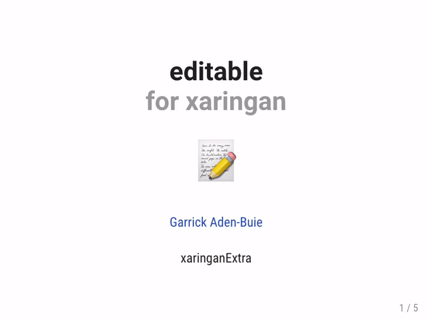
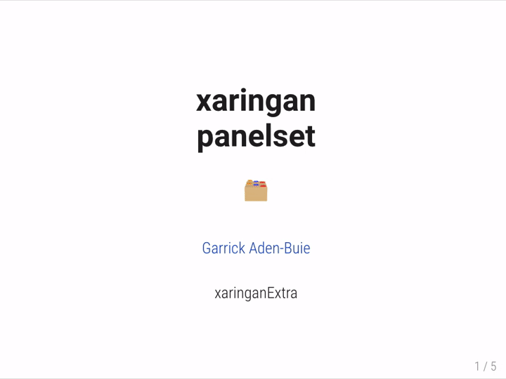

# xaringanExtra

<!-- badges: start -->
<!-- badges: end -->

<!-- Links -->
[xaringan]: https://slides.yihuie.name/xaringan
[remarkjs]: http://remarkjs.com/
[animate.css]: http://daneden.github.io/animate.css
[text-poster]: https://github.com/IMAGINARY/text-poster#readme

`xaringanExtra` is a playground of enhancements and extensions for [xaringan] slides.

- Add an overview of your presentation with [tile view](#-tile-view)
- Make your slides [editable](#-editable)
- Announce slide changes with a [subtle tone](#-slide-tone)
- Animate slide transitions with [animate.css](#-animatecss)
- Add tabbed panels to slides with [panelset](#-panelset)
- Add a logo to all of your slides with [logo](#-logo)
- Use the [Tachyons CSS utility toolkit](#-tachyons)
- Create fancy [poster-style text blocks](#-text-poster)
- Fit your slides to [fill the browser window](#-fit-to-screen)

Each item can be enabled separately, 
or load everything at once with a single call.

````markdown
```{r xaringanExtra, echo=FALSE}
xaringanExtra::use_xaringan_extra(c("tile_view", "animate_css", "tachyons"))
```
````

## Installation

You can install the current version of xaringanExtra from GitHub.

``` r
# install.packages("devtools")
devtools::install_github("gadenbuie/xaringanExtra")
```

## &#x1F5FA; Tile View

#### &#x1F4FA; [Tile View Demo](https://gadenbuie.github.io/xaringanExtra/tile-view)

Tile view gives you a way to quickly jump between slides.
Just press <kbd>O</kbd> 
(the letter **O** for **O**verview)
at any point in your slideshow and the tile view appears.
Click on a slide to jump to the slide, or press <kbd>O</kbd> to exit tile view.


To add tile view to your xaringan presentation, 
add the following code chunk to your slides' R Markdown file.

````markdown
```{r xaringan-tile-view, echo=FALSE}
xaringanExtra::use_tile_view()
```
````

Tile view is heavily inspired by
(and is essentially a port to Vanilla JavaScript of)
[a jQuery remarkjs hook](https://github.com/StephenHesperus/remark-hook/)
by the same name by [Stephen Hesperus](https://github.com/StephenHesperus).

## &#x1F4DD; Editable

#### &#x1F4FA; [Editable Demo](https://gadenbuie.github.io/xaringanExtra/editable)

Editable gives you a way to write directly inside your slides, 
updating your content live. 
Make any element of your slides editable by using the `.can-edit[...]` class. 



Make your slides editable with the following code chunk.

````markdown
```{r xaringan-editable, echo=FALSE}
xaringanExtra::use_editable(expires = 1)
```
````

Then, to make a component of your slides editable, 
use the `.can-edit[]` class.

```markdown
## .can-edit[You can edit this slide title]
```

Editable fields that only have the `.can-edit` class 
are reset whenever the slides are re-loaded in your browser. 
If you want to store the edited values and 
have them persist across browser sessions, 
give each editable field a `.key-<NAME>` class. 
Be sure to make each key unique and 
note that the key name must be a valid CSS class, 
i.e. it cannot contain spaces.

```markdown
## .can-edit.key-firstSlideTitle[Change this title and then reload the page]
```

For more complicated HTML elements,
it's best to make only spans of text editable, such as

```
Hello, .can-edit[world], and welcome to my talk!
```

or to use placeholder text.

```markdown
## A few of my favorite things

.can-edit.key-likes[
- thing one
- thing two
]
```

## &#x1F50A; Slide Tone

#### &#x1F4FA; [Slide Tone Demo](https://gadenbuie.github.io/xaringanExtra/slide-tone)

Slide tone plays a subtle sound when you change slides.
It was 
[requested by a blind R user](https://github.com/yihui/xaringan/issues/214)
and enables users to hear an auditory signal of their progress through the slides.

The tones increase in pitch for each slide from a low C to a high C note.
The tone pitch stays the same for incremental slides.

Visit the 
[slide tone demo slides](https://gadenbuie.github.io/xaringanExtra/slide-tone)
to experience it yourself.
Or include slide tone in your next xaringan presentation 
by adding the following code chunk to your slides' R Markdown.

````markdown
```{r xaringan-slide-tone, echo=FALSE}
xaringanExtra::use_slide_tone()
```
````

## &#x1F4FD; Animate.css

#### &#x1F4FA; [Animate.css Demo](https://gadenbuie.github.io/xaringanExtra/animate-css)

[Animate.css] is a popular collection of CSS animations. It contains 

> a bunch of cool, fun, and cross-browser animations for you to use in your
> projects. Great for emphasis, home pages, sliders, and general
> just-add-water-awesomeness.

Use `use_animate_css()` to include the animate.css stylesheets in your slides.
This function automatically modifies the CSS selector that enables the animation
so that only the slides that are visible are animated.
This drastically improves performance on large slide decks with many animations.
For use in other HTML documents, 
set `xaringan = FALSE` to load the default `animate.css` file 
without this performance tweak.

To use animate.css in your slides, 
add the following code chunk to your slides' R Markdown.

````markdown
```{r xaringan-animate-css, echo=FALSE}
xaringanExtra::use_animate_css()
```
````

Then add the `animated` class and the [desired animation class][animate.css] to the slides you want to animate.
`Out` animations are only applied to slides on exit.

```markdown
---
class: animated slideInRight fadeOutLeft

## This slide...

- slides in from the right 
- and fades out to the left on exit
```

If you want to use the same slide transitions for all slides,
you can use `use_animate_all()`.
This function sets a default in and out animation for all slides. 
Animations can be disabled for individual slides 
by adding the class `no-animation` to the slide.

````markdown
```{r xaringan-animate-all, echo=FALSE}
xaringanExtra::use_animate_all("slide_left")
```
````

Note: because `use_animate_all()` only imports the CSS required for the slide in and slide out animations, 
you need to also include `use_animate_css()` (see above)
if you want to use other animations from `animate.css` in your slides.

## &#x1F5C2; Panelset

#### &#x1F4FA; [Panelset Demo](https://gadenbuie.github.io/xaringanExtra/panelset)

Panelset adds accessible tabbed panels — 
just like R Markdown's `.tabset` panels —
to your xaringan slides.
You can activate a panel by clicking on the tab,
or you can use the keyboard.
When you reach a slide with a panelset,
the left and right arrows will step through the panels.

To use panelset, add the following chunk to your slides.

````markdown
```{r xaringan-panelset, echo=FALSE}
xaringanExtra::use_panelset()
```
````



Then, create a `.panelset[...]` that contains `.panels[]`.
Each `.panel[]` should have a `.panel-name[]` and content 
(everything that isn't the panel's name).

```markdown
.panel[.panel-name[NAME]
...content...
]
```

Here's the example used in the demo slides.

````markdown
.panelset[
.panel[.panel-name[R Code]

```{r panel-chunk, fig.show='hide'}
# ... r code ...
```
]

.panel[.panel-name[Plot]

`)
]
]
````

To customize the appearance of your panels,
you can use `style_panelset()` 
called directly in an R chunk in your slides.

````markdown
```{r echo=FALSE}
style_panelset(panel_tab_color_active = "red")
```
````

The panelset uses custom CSS properties to make
it easier to change the styles of the panel tabs.
The default values are shown in the CSS code below. 
You can copy the whole CSS block to your slides and 
modify the values to customize the style to fit your presentation.

````markdown
```{css echo=FALSE}
.panelset {
  --panel-tab-color: currentColor;
  --panel-tab-color-active: currentColor;
  --panel-tab-color-hover: currentColor;
  --panel-tabs-border-bottom: #ddd;
  --panel-tab-inactive-opacity: 0.5;
  --panel-tab-font-family: Menlo, Consolas, Monaco, Liberation Mono, Lucida Console, monospace;
}
```
````


## &#x1F48C; Logo

#### &#x1F4FA; [Logo Demo](https://gadenbuie.github.io/xaringanExtra/logo)

`use_logo()` adds a logo to all of your slides. 
You can make the logo a clickable link and choose where on the slide it is placed. 
You can also set which types of slides will not get the logo by default.

To add a logo to your xaringan presentation, 
add the following code chunk to your slides' R Markdown file.

````markdown
```{r xaringan-logo, echo=FALSE}
xaringanExtra::use_logo(
  image_url = "https://raw.githubusercontent.com/rstudio/hex-stickers/master/PNG/xaringan.png"
)
```
````

See the documentation for `?use_logo` for more options regarding sizing
and positioning. You can also make the logo a link using `link_url`.


## &#x1F3D7; Tachyons

#### &#x1F4FA; [Tachyons Demo](https://gadenbuie.github.io/xaringanExtra/tachyons)

[tachyons]: http://tachyons.io/
[tachyons-docs]: http://tachyons.io/docs/
[tachyons-cheatsheet]: https://roperzh.github.io/tachyons-cheatsheet/

[Tachyons] is a collection of CSS utility classes
that works beautifully with [xaringan] presentations
and the [remarkjs] class syntax.

To use tachyons in your slides,
add the following code chunk to your slides' R Markdown.

````markdown
```{r xaringan-tachyons, echo=FALSE}
xaringanExtra::use_tachyons()
```
````

Tachyons provides small, single-purpose CSS classes that are easily composed to achieve larger functionality and styles.
In the 
[remarkjs content classes syntax](https://github.com/gnab/remark/wiki/Markdown#content-classes),
you can compose classes by chaining them together.
For example, 
the following markdown produces a box with a 
washed green background (`.bg-washed-green`)
and a dark green border (`.b--dark-green`)
on all sides (`.ba`)
with line width 2 (`.bw2`)
and border radius (`.br3`).
The box has a shadow (`.shadow-5`)
and medium-large horizontal padding (`.ph4`)
with a large top margin (`.mt5`).

```markdown
.bg-washed-green.b--dark-green.ba.bw2.br3.shadow-5.ph4.mt5[
The only way to write good code is to write tons of bad code first. 
Feeling shame about bad code stops you from getting to good code

.tr[
— Hadley Wickham
]]
```


Tachyons provides hundreds of CSS classes that are abbreviated and terse,
so it takes some time to learn.
In addition to the [tachyons documentation][tachyons-docs],
the [Tachyons Cheatsheet][tachyons-cheatsheet] is an excellent and easy to use reference.

## &#x1F520; Text Poster

#### &#x1F4FA; [Text Poster Demo](https://gadenbuie.github.io/xaringanExtra/text-poster)

_Text poster_ typesets text to fit within a rectangular bounding box, 
with the text on each line scaled to fit the horizontal space.
Built using [text-poster.js][text-poster].


````markdown
---
class: center middle

`r xaringanExtra::text_poster(
  "There are no 
  routine statistical
  questions, only questionable 
  statistical routines."
)`

.footnote.pull-right[— Sir David Cox]

```{css echo=FALSE}
@import url('https://fonts.googleapis.com/css?family=Merriweather:300');

.text-poster {
	font-family: 'Merriweather', serif;
}
```
````

## &#x1F4D0; Fit to Screen

#### &#x1F4FA; [Fit to Screen Demo](https://gadenbuie.github.io/xaringanExtra/fit-screen)

xaringan/remark slides scale at a consistent ratio when the browser window is resized.
In other words, if the slide ratio is `4:3`, 
then remark scales the slides and positions them in the browser window 
so that they maintain the aspect ratio.

In certain situations, 
like when showing slides in split screen next to another window like RStudio,
this causes the slides to become rather small.
Alternatively,
it's a great way to be able to adapt your slides 
to the aspect ratio of the projector or television screen
when you don't know the ratio ahead of time.

This extension adds a short cut key — <kbd>Alt</kbd>/<kbd>Option</kbd>+ <kbd>F</kbd> —
that fits the slides to the screen and ignores the slide ratio.
(Currently, it only turns on; reload your slides to return to normal.)


````markdown
```{r xaringan-fit-screen, echo=FALSE}
xaringanExtra::use_fit_screen()
```
````
